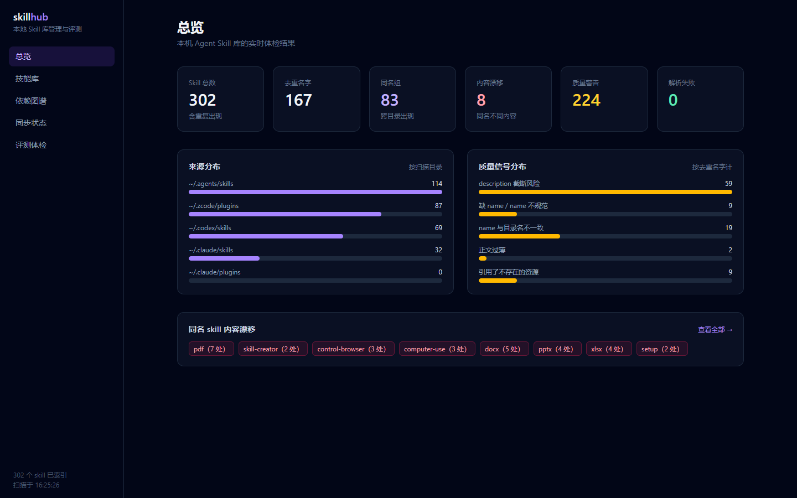
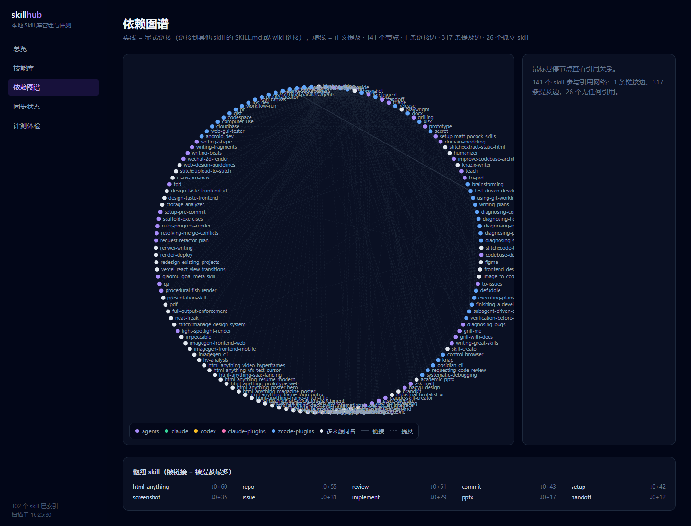
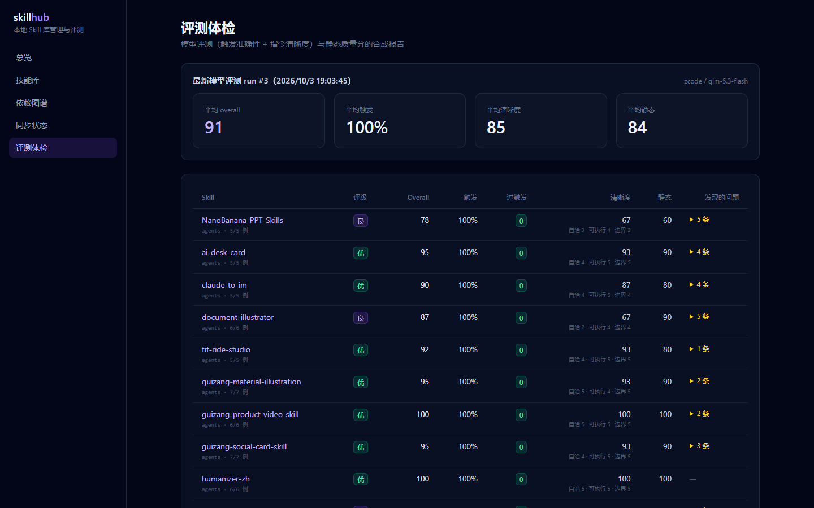

# skill-hub

[](https://github.com/Carlostang050311/skill-hub/actions/workflows/ci.yml)

[中文](README.md) | [English](README.en.md)

本地优先的 Agent Skill 管理与评测平台：把散落在多个 agent 目录的 skill 变成带元数据的数据库 + 可执行的评测闭环。



## 为什么

Skill 本质 = frontmatter（name/description）+ 正文指令 + 附属资源文件。围绕它只有三个根本问题：**发现**（我有什么、哪个适用）、**质量**（好不好用没信号）、**分发**（怎么装进 N 个 agent 目录并保持同步）。市面工具只做了分发（skills.sh 等）；skill-hub 补上本地库存管理、跨目录同步检测与质量评测——评测是护城河：静态 lint 抓格式问题，模型评测抓语义问题。

## 功能

- **索引**：扫描 `~/.agents/skills`、`~/.claude/skills`、`~/.codex/skills` 与 Claude/ZCode 插件缓存，解析 frontmatter，内容指纹去重、静态质量信号（description 截断风险、缺失资源引用、name 规范等）、显式引用 + 正文提及两路依赖信号
- **Web UI**（Next.js 15）：总览、技能库搜索、详情（正文渲染 + 引用/提及网络 + 一键安装）、依赖图谱（链接实线 / 提及虚线）、同步状态（漂移检测 + 一键对齐）、评测报告与历史趋势（跨 run 对比、同名 skill 修复前后变化）
- **评测框架**：scenario YAML（触发正/反用例）→ `plan` 生成作业 → 模型端跑批（ZCode 子代理或 OpenAI 兼容 API）→ `ingest` 三层评分入库（触发 40% + 清晰度 30% + 静态 30%）；**执行级评测**（`exec`）让 skill 在沙箱真实干活，双评审独立复核
- **分发同步**：`install/uninstall/outdated/pack`，同名多副本按 agents > claude > codex 选源，冲突需 `--force`
- **GitHub 生态**：`github-install <owner/repo>`（发现 SKILL.md → 查重 → 安装 → 登记来源）、`origins` 上游注册表、`outdated-remote` 目录指纹对比上游（`--apply` 一键更新）；`search-remote` 直接搜 skills.sh 全生态，`adopt` 把搜到的 skill 收编进本机管理体系
- **agent 查库**：`recommend "<任务描述>"` 按任务推荐 skill（中英文关键词 + 质量信号参与排序），配套 meta-skill `skill-finder` 让编码代理干活前自动查库（随仓库 `skills/` 目录分发）；可选 `scripts/hook/prompt-recommend.mjs`（ZCode UserPromptSubmit hook）在每条用户消息时主动注入推荐



## 快速开始

```bash
npm install
npm run build
npm test                       # Vitest 全量测试

npm run skillhub -- scan       # 扫描本机全部 skill 目录
npm run skillhub -- list       # 列出全部 skill
npm run skillhub -- recommend "把这篇文章做成小红书图文卡片"

npm run start -w @skillhub/web # Web UI → http://localhost:3457
```

更多命令见 [README 使用手册](README.md#快速开始)：评测、GitHub 安装、分发同步。



## 从 skills.sh 安装

`skill-finder` 已收录到 skills.sh 目录，用 skills CLI 一条命令安装：

```bash
npx skills add Carlostang050311/skill-hub
```

仓库页：[skills.sh/Carlostang050311/skill-hub](https://www.skills.sh/Carlostang050311/skill-hub)

## 让 agent 自己查库（MCP server）

```bash
npm run skillhub -- recommend "把这篇文章做成小红书图文卡片"   # CLI 直接查
```

也可以把 skill-hub 作为 MCP server 接进 Claude Code / ZCode 等客户端，agent 干活时自动查库：

```json
{
  "mcpServers": {
    "skill-hub": {
      "command": "node",
      "args": ["/path/to/skill-hub/packages/mcp/dist/server.js"]
    }
  }
}
```

暴露三个工具：`recommend_skills`（任务→推荐）、`get_skill`（详情+正文）、`library_stats`（库统计）。配套 meta-skill `skills/skill-finder` 定义了 agent 的查库决策规则。设 `SKILLHUB_HOME` 环境变量可指向自定义主目录（默认本机）。

## 公开质量榜

[skill-hub 质量榜](https://carlostang050311.github.io/skill-hub/leaderboard/)——skills.sh 告诉你什么装得多，这里告诉你什么真的好。数据由 `npm run skillhub-eval -- export` 从本地评测库生成（docs/leaderboard/data.json + 静态页），随评测更新。

## 真实运行数据

在本机 318 个真实 skill 的库上：

- 9 轮评测、累计约 1700 个作业，184 个 skill 有公开评分；触发准确率 100%、零过触发
- 抓出 description 缺失、正文自相矛盾、依赖不匹配、硬编码路径等真实缺陷（含 skill-hub 自己的 skill）
- 执行级评测 11 个 skill 在沙箱真实干活，双评审独立复核全部满分
- 上游检测抓到第三方仓库的真实更新

## 架构

npm workspaces monorepo，TypeScript 全栈：

```
packages/core   索引/解析/指纹/质量信号/图谱/分发/GitHub/推荐
packages/cli    skillhub 命令行
packages/mcp    MCP server（recommend_skills / get_skill / library_stats）
apps/web        Next.js 15 + Tailwind v4 仪表盘
apps/eval       评测 runner（含执行级 + 生成器）+ node:sqlite 报告库
scripts/hook    ZCode UserPromptSubmit 主动推荐 hook
```

## License

[MIT](LICENSE)
